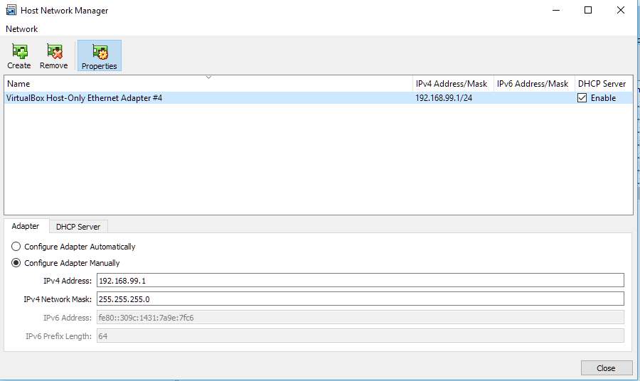

# Network security project
This repro contains all the code needed to run the project.

# Bootstrap
Before you start, make sure you have pip installed. If you are on Mac OS X, then install Python using Homebrew. That would automatically install pip for you! If you haven’t installed Python using Homebrew, you should definitely give it a try. It will save from a lot of headache everywhere in Python-land! If you are on Ubuntu, just run the following command on your terminal:

```bash
    sudo apt-get install python3-pip
```
We are now ready to install Flask. Run the following command on your terminal:
```bash
    pip3 install flask
```
You should see the installation success message printed on your terminal.

NOTE: Pseudo-random number generation requires python3

# Run
To run the server run from your terminal and open [localhost:5000](localhost:5000 "") in your favourite browser.
```bash
    cd code
    python main.py
```

# Configuration
We have 2 users: admin and an ordinary user. In the final version, only way to log in as an admin will be to break PRNG. For now, you can use very long password to login as an administrator.
PRNG seed is hardcoded to 1337, but we can change it to os.urandom in release.


# Codebreaking
You will need python3 and requests library to run two code-breaking scripts. After running the server, run dataFetch.py. It will generate a text file with 625 login tokens. Afterwards, run mersenne-twister-recover.py. It will analyze the output of the previous script, and print the next 50 tokens.

Take the first token, and copy it to your browser as netsecLoginCookie value. Wait for the next admin login, and hijack his session :D

Note that if you cannot obtain 625 consecutive tokens, you can try to brute-force the ones you have using untwister. This usually takes 2-4 hrs.


#Host-only adapters

If you get an error when starting the VMs about a non existing adapter it's probably because of that **Host-only adapters**. The **Host-only adapters** are here just to connect directly from the host machine running the VMs to each VM without having to resort to tunneling. In a realistic scenario this separate network **would not exist.**




Configuration for **Host-only** adapter.

